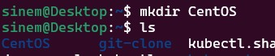

# CREATE A JENKINS SERVER ON DOCKER CONTAINER

To install a Jenkins server on a Docker container, you can follow these steps:

## S T E P S 
1. Pull the Jenkins Docker image:
- Open your terminal and run the following command to pull the official Jenkins image from Docker Hub:

```bash
docker pull jenkins/jenkins:lts
```

2. Run the Jenkins container:
- Once the image is downloaded, you can create and run a Jenkins container using the following command:

```bash
docker run -d -p 8080:8080 -p 50000:50000 --name jenkins -v jenkins_home:/var/jenkins_home jenkins/jenkins:lts
```
- **Commnand Breakdown**:
 - `-d` runs the container in detached mode,
 - `-p` `8080:8080` maps port `8080` on your *host* to *port* `8080` on the container,
 - `-p` `50000:50000` maps port `50000` on your *host* to *port* `50000` on the container.
- The `-v jenkins_home:/var/jenkins_home` option **mounts** a *volume* for `Jenkins data persistence.`


3. Access Jenkins:
- Open your *web browser* and navigate to `http://localhost:8080`. You should see the Jenkins initial setup screen


4. Unlock Jenkins:
- The initial setup requires a password stored in the Jenkins home directory inside the container. You can get this password by running:

```bash
docker exec jenkins cat /var/jenkins_home/secrets/initialAdminPassword
```


- **Commnand Breakdown**:

- `docker exec:` The docker exec command is used to run a command in a running Docker container. This command allows you to interact with the container's file system and processes.
- `jenkins:` This is the name of the running Docker container in which you want to execute the command. In this case, the container is named jenkins.

- `cat /var/jenkins_home/secrets/initialAdminPassword`:
    - `cat:`The cat command is used to read and display the content of files.
    - `/var/jenkins_home/secrets/initialAdminPassword`:This is the file path inside the Jenkins container where the initial admin password is stored. Jenkins creates this file during the initial setup process.

5. Install suggested plugins:
- Follow the on-screen instructions to install the suggested plugins or customize the installation based on your needs.

6. Create an admin user:
- Once the plugins are installed, you'll be prompted to create an admin user. Complete the setup and start using Jenkins.


- Welcome to Jenkins


## SSH INTO JENKINS SERVER RUNNING ON DOCKER CONTAINER


To SSH into a Jenkins container (or any Docker container), you can use the docker exec command with an interactive shell. Here’s how you can do it:


- Check if the Jenkins container is running:

```bash
docker ps
```


- SSH into the Jenkins container:

```bash
docker exec -it jenkins bash
```

- You should now see:


## HOW TO EXECUTE JOBS IN A REMOTE MACHINE (ANOTHER DOCKER CONTAINER) WITH JENKINS

- Create a file and name `CentOS`

```bash
mkdir CentOS
ls
```



- Create a [Dockerfile](/CentOS/Dockerfile) for CentOS image ; 

```bash
touch Dockerfile
```

- Now you can use text editor tools (nano,vim..) copy and paste following; 

```Dockerfile
FROM centos

# Install OpenSSH server
RUN yum -y install openssh-server

# Create a user and set up SSH access
RUN useradd remote_user && \
    echo "remote_user:1234" | chpasswd && \
    mkdir /home/remote_user/.ssh && \
    chmod 700 /home/remote_user/.ssh
```


## Create SSH Key for the remote connection

The command `ssh-keygen -f remote-key `is used to generate SSH keys and specifies the output file name for the key. Here's a detailed explanation of the command:

```bash
ssh-keygen -f remote-key
```


- Create an image from [Dockerfile](/CentOS/Dockerfile)


```bash

```
```bash

```
```bash

```

```bash

```
```bash

```
```bash

```
```bash

```
```bash

```
```bash

```
```bash

```
```bash

```
